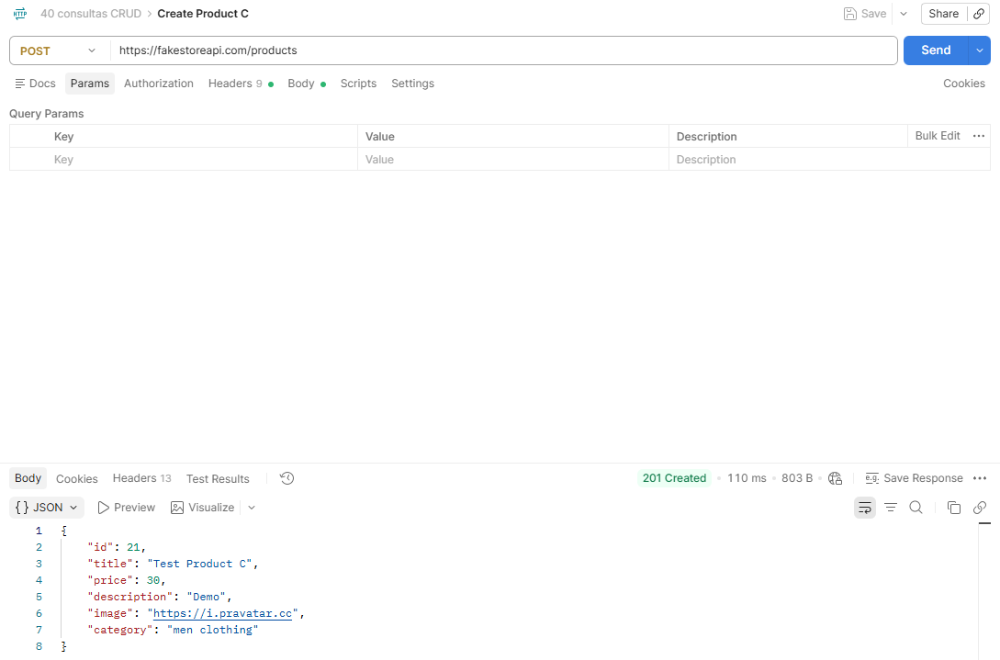
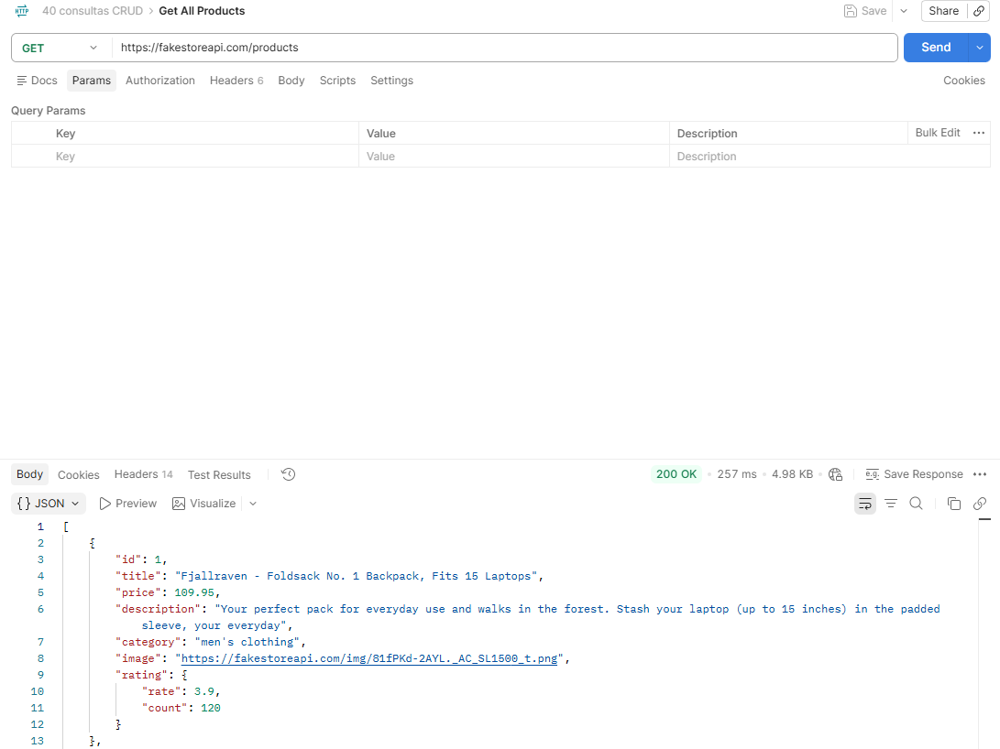
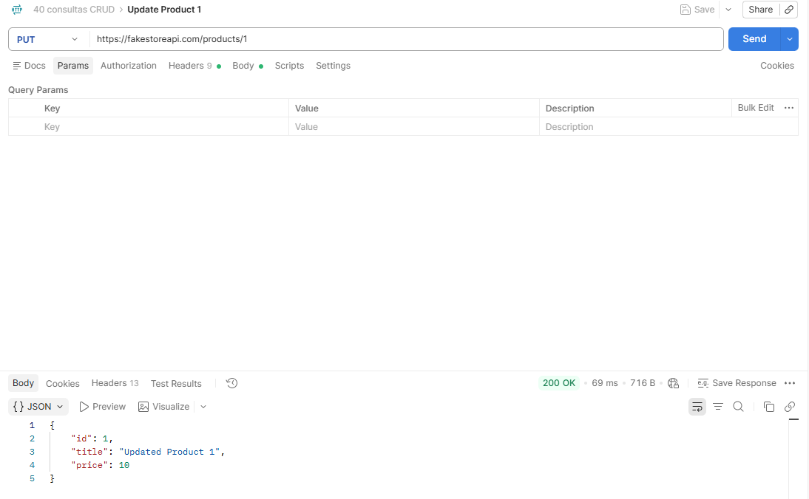
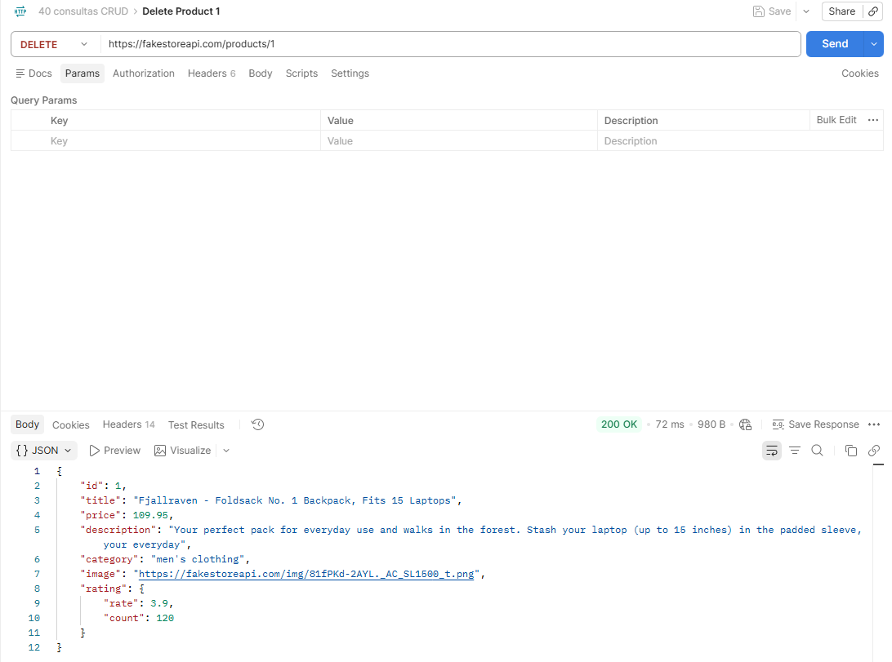

# Ejercicios CRUD con FakeStoreAPI

Base URL:
```http
https://fakestoreapi.com
```

---
# CREATE
### Captura de ejemplo


---
## CREATE 1

### Petición
```json
{
  "sample": "create1"
}
```

### Comando
```http
POST https://fakestoreapi.com/products
```

### Resultado
```json
{
    "id": 21,
    "title": "Test Product A",
    "price": 10.5,
    "description": "Demo",
    "image": "https://i.pravatar.cc",
    "category": "electronics"
}
```

---
## CREATE 2

### Petición
```json
{
  "sample": "create2"
}
```

### Comando
```http
POST https://fakestoreapi.com/products
```

### Resultado
```json
{
    "id": 21,
    "title": "Test Product B",
    "price": 20,
    "description": "Demo",
    "image": "https://i.pravatar.cc",
    "category": "jewelery"
}
```

---
## CREATE 3

### Petición
```json
{
  "sample": "create3"
}
```

### Comando
```http
POST https://fakestoreapi.com/products
```

### Resultado
```json
{
    "id": 21,
    "title": "Test Product C",
    "price": 30,
    "description": "Demo",
    "image": "https://i.pravatar.cc",
    "category": "men clothing"
}
```

---
## CREATE 4

### Petición
```json
{
  "sample": "create4"
}
```

### Comando
```http
POST https://fakestoreapi.com/carts
```

### Resultado
```json
{
  "id": 21,
  "userId": 1,
  "date": "2020-02-03",
  "products": [
    {
      "productId": 1,
      "quantity": 2
    }
  ]
}
```

---
## CREATE 5

### Petición
```json
{
  "sample": "create5"
}
```

### Comando
```http
POST https://fakestoreapi.com/carts
```

### Resultado
```json
{
  "id": 21,
  "userId": 2,
  "date": "2020-02-03",
  "products": [
    {
      "productId": 2,
      "quantity": 1
    }
  ]
}
```

---
## CREATE 6

### Petición
```json
{
  "sample": "create6"
}
```

### Comando
```http
POST https://fakestoreapi.com/users
```

### Resultado
```json
{
  "id": 21,
  "email": "john@example.com",
  "username": "john",
  "password": "12345"
}
```

---
## CREATE 7

### Petición
```json
{
  "sample": "create7"
}
```

### Comando
```http
POST https://fakestoreapi.com/users
```

### Resultado
```json
{
  "id": 21,
  "email": "ana@example.com",
  "username": "ana",
  "password": "12345"
}
```

---
## CREATE 8

### Petición
```json
{
  "sample": "create8"
}
```

### Comando
```http
POST https://fakestoreapi.com/auth/login
```

### Resultado
```json
{
  "token": "<token generado por la API>"
}
```

---
## CREATE 9

### Petición
```json
{
  "sample": "create9"
}
```

### Comando
```http
POST https://fakestoreapi.com/products
```

### Resultado
```json
{
  "id": 21,
  "title": "Test Product D",
  "price": 99,
  "description": "Demo",
  "image": "https://i.pravatar.cc",
  "category": "electronics"
}
```

---
## CREATE 10

### Petición
```json
{
  "sample": "create10"
}
```

### Comando
```http
POST https://fakestoreapi.com/products
```

### Resultado
```json
{
  "id": 21,
  "title": "Test Product E",
  "price": 77,
  "description": "Demo",
  "image": "https://i.pravatar.cc",
  "category": "jewelery"
}
```

---
# READ
### Captura de ejemplo


---
## READ 1

### Comando
```http
GET https://fakestoreapi.com/products
```

### Resultado
```json
[
  {
    "id": 1,
    "title": "Fjallraven - Foldsack No. 1 Backpack, Fits 15 Laptops",
    "price": 109.95,
    "category": "men's clothing"
  }
]
```

---
## READ 2

### Comando
```http
GET https://fakestoreapi.com/products/1
```

### Resultado
```json
{
  "id": 1,
  "title": "Fjallraven - Foldsack No. 1 Backpack, Fits 15 Laptops",
  "price": 109.95,
  "description": "Your perfect pack for everyday use and walks in the forest. Stash your laptop (up to 15 inches) in the padded sleeve, your everyday",
  "category": "men's clothing",
  "image": "https://fakestoreapi.com/img/81fPKd-2AYL._AC_SL1500_t.png",
  "rating": {
    "rate": 3.9,
    "count": 120
  }
}
```

---
## READ 3

### Comando
```http
GET https://fakestoreapi.com/products?limit=5
```

### Resultado
```json
[
  {
    "id": 1,
    "title": "Fjallraven - Foldsack No. 1 Backpack, Fits 15 Laptops",
    "price": 109.95,
    "category": "men's clothing"
  }
]
```

---
## READ 4

### Comando
```http
GET https://fakestoreapi.com/products?sort=desc
```

### Resultado
```json
[
  {
    "id": 20,
    "title": "DANVOUY Womens T Shirt Casual Cotton Short",
    "price": 12.99,
    "category": "women's clothing"
  }
]
```

---
## READ 5

### Comando
```http
GET https://fakestoreapi.com/products/categories
```

### Resultado
```json
{
  "value": ["electronics", "jewelery", "men's clothing", "women's clothing"],
  "Count": 4
}
```

---
## READ 6

### Comando
```http
GET https://fakestoreapi.com/products/category/electronics
```

### Resultado
```json
[
  {
    "id": 9,
    "title": "WD 2TB Elements Portable External Hard Drive - USB 3.0",
    "price": 64,
    "category": "electronics"
  }
]
```

---
## READ 7

### Comando
```http
GET https://fakestoreapi.com/carts
```

### Resultado
```json
[
  {
    "id": 1,
    "userId": 1,
    "date": "2020-03-02",
    "products": [{"productId": 1, "quantity": 4}]
  }
]
```

---
## READ 8

### Comando
```http
GET https://fakestoreapi.com/carts/1
```

### Resultado
```json
{
  "id": 1,
  "userId": 1,
  "date": "2020-03-02",
  "products": [{"productId": 1, "quantity": 4}]
}
```

---
## READ 9

### Comando
```http
GET https://fakestoreapi.com/users
```

### Resultado
```json
[
  {
    "id": 1,
    "email": "mor_2314@example.com",
    "username": "mor_2314"
  }
]
```

---
## READ 10

### Comando
```http
GET https://fakestoreapi.com/users/1
```

### Resultado
```json
{
  "id": 1,
  "email": "mor_2314@example.com",
  "username": "mor_2314",
  "password": "83r5^_"
}
```

---
# UPDATE
### Captura de ejemplo


---
## UPDATE 1

### Petición
```json
{
  "title": "Updated Product 1",
  "price": 10
}
```

### Comando
```http
PUT https://fakestoreapi.com/products/1
```

### Resultado
```json
{
  "id": 1,
  "title": "Updated Product 1",
  "price": 10
}
```

---
## UPDATE 2

### Petición
```json
{
  "title": "Updated Product 2",
  "price": 20
}
```

### Comando
```http
PUT https://fakestoreapi.com/products/2
```

### Resultado
```json
{
  "id": 2,
  "title": "Updated Product 2",
  "price": 20
}
```

---
## UPDATE 3

### Petición
```json
{
  "title": "Updated Product 3",
  "price": 30
}
```

### Comando
```http
PUT https://fakestoreapi.com/products/3
```

### Resultado
```json
{
  "id": 3,
  "title": "Updated Product 3",
  "price": 30
}
```

---
## UPDATE 4

### Petición
```json
{
  "title": "Updated Product 4",
  "price": 40
}
```

### Comando
```http
PUT https://fakestoreapi.com/products/4
```

### Resultado
```json
{
  "id": 4,
  "title": "Updated Product 4",
  "price": 40
}
```

---
## UPDATE 5

### Petición
```json
{
  "title": "Updated Product 5",
  "price": 50
}
```

### Comando
```http
PUT https://fakestoreapi.com/products/5
```

### Resultado
```json
{
  "id": 5,
  "title": "Updated Product 5",
  "price": 50
}
```

---
## UPDATE 6

### Petición
```json
{
  "email": "user1@example.com",
  "username": "user1"
}
```

### Comando
```http
PUT https://fakestoreapi.com/users/1
```

### Resultado
```json
{
  "id": 1,
  "email": "user1@example.com",
  "username": "user1"
}
```

---
## UPDATE 7

### Petición
```json
{
  "email": "user2@example.com",
  "username": "user2"
}
```

### Comando
```http
PUT https://fakestoreapi.com/users/2
```

### Resultado
```json
{
  "id": 2,
  "email": "user2@example.com",
  "username": "user2"
}
```

---
## UPDATE 8

### Petición
```json
{
  "email": "user3@example.com",
  "username": "user3"
}
```

### Comando
```http
PUT https://fakestoreapi.com/users/3
```

### Resultado
```json
{
  "id": 3,
  "email": "user3@example.com",
  "username": "user3"
}
```

---
## UPDATE 9

### Petición
```json
{
  "email": "user4@example.com",
  "username": "user4"
}
```

### Comando
```http
PUT https://fakestoreapi.com/users/4
```

### Resultado
```json
{
  "id": 4,
  "email": "user4@example.com",
  "username": "user4"
}
```

---
## UPDATE 10

### Petición
```json
{
  "email": "user5@example.com",
  "username": "user5"
}
```

### Comando
```http
PUT https://fakestoreapi.com/users/5
```

### Resultado
```json
{
  "id": 5,
  "email": "user5@example.com",
  "username": "user5"
}
```

---
# DELETE
### Captura de ejemplo


---
## DELETE 1

### Comando
```http
DELETE https://fakestoreapi.com/products/1
```

### Resultado
```json
{
  "id": 1,
  "title": "Fjallraven - Foldsack No. 1 Backpack, Fits 15 Laptops",
  "price": 109.95,
  "category": "men's clothing"
}
```

---
## DELETE 2

### Comando
```http
DELETE https://fakestoreapi.com/products/2
```

### Resultado
```json
{
  "id": 2,
  "title": "Mens Casual Premium Slim Fit T-Shirts",
  "price": 22.3,
  "category": "men's clothing"
}
```

---
## DELETE 3

### Comando
```http
DELETE https://fakestoreapi.com/products/3
```

### Resultado
```json
{
  "id": 3,
  "title": "Mens Cotton Jacket",
  "price": 55.99,
  "category": "men's clothing"
}
```

---
## DELETE 4

### Comando
```http
DELETE https://fakestoreapi.com/products/4
```

### Resultado
```json
{
  "id": 4,
  "title": "Mens Casual Slim Fit",
  "price": 15.99,
  "category": "men's clothing"
}
```

---
## DELETE 5

### Comando
```http
DELETE https://fakestoreapi.com/products/5
```

### Resultado
```json
{
  "id": 5,
  "title": "John Hardy Women's Legends Naga Gold & Silver Dragon Station Chain Bracelet",
  "price": 695,
  "category": "jewelery"
}
```

---
## DELETE 6

### Comando
```http
DELETE https://fakestoreapi.com/carts/1
```

### Resultado
```json
{
  "id": 1,
  "userId": 1,
  "date": "2020-03-02",
  "products": [{"productId": 1, "quantity": 4}]
}
```

---
## DELETE 7

### Comando
```http
DELETE https://fakestoreapi.com/carts/2
```

### Resultado
```json
{
  "id": 2,
  "userId": 1,
  "date": "2020-01-02",
  "products": [{"productId": 2, "quantity": 1}]
}
```

---
## DELETE 8

### Comando
```http
DELETE https://fakestoreapi.com/users/1
```

### Resultado
```json
{
  "id": 1,
  "email": "mor_2314@example.com",
  "username": "mor_2314"
}
```

---
## DELETE 9

### Comando
```http
DELETE https://fakestoreapi.com/users/2
```

### Resultado
```json
{
  "id": 2,
  "email": "snyder@ example.com",
  "username": "snyder"
}
```

---
## DELETE 10

### Comando
```http
DELETE https://fakestoreapi.com/users/3
```

### Resultado
```json
{
  "id": 3,
  "email": "rachel@example.com",
  "username": "johnd"
}
```
